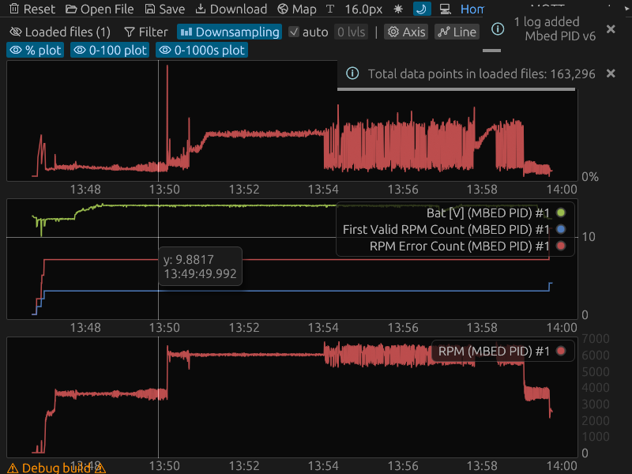

<div align="center">
  <a href="https://github.com/luftkode/plotinator3000/releases" title="Latest Stable GitHub Release">
      </a>
  <a href="https://github.com/luftkode/plotinator3000/actions/workflows/CI.yml"></a>
</div>
<div align="center">
    &thinsp;
    &thinsp;
    
</div>


# SkyTEM Plotinator3000

## Purpose

Inspect logs from SkyTEM systems.

## Example (snapshot)



## Why is this repository public?

For inspiration/educational purposes. Anyone developing `egui`/`eframe` apps may or may not find any of the solutions in this repository useful for their own project(s).

## Installation

See the [latest release](https://github.com/luftkode/plotinator3000/releases/latest) and choose the installation method you prefer, or if you're lazy you can choose the recommended method for your system below.

### 🖥️ Windows 🖥️

Download the [latest MSI installer: plotinator3000-x86_64-pc-windows-msvc.msi](https://github.com/luftkode/plotinator3000/releases/latest/download/plotinator3000-x86_64-pc-windows-msvc.msi).

### 🍎 MacOS & 🐧 Linux

Run the installation script in a terminal

```console
curl --proto '=https' --tlsv1.2 -LsSf https://github.com/luftkode/plotinator3000/releases/latest/download/plotinator3000-installer.sh | sh
```

## Developing

### Quick start

Check the [Justfile](Justfile) for recipes to get started, or invoke `just` to list available recipes.

Check if code compiles

```shell
just check
```

Run

```shell
just run
```

### The code

The plotinator3000 is implemented with [eframe](https://github.com/emilk/egui/tree/master/crates/eframe), a framework for the [egui](https://github.com/emilk/egui) GUI library and for the plotting functionality, the [egui_plot](https://github.com/emilk/egui_plot) library is used.

All the boilerplate and workflows etc. is pulled from [this eframe template](https://github.com/emilk/eframe_template) which is kept up to date with `egui`/`eframe` and should be a good source for updating this project for recent `egui`/`eframe` versions.

### Infrastructure (CI, releases)

#### Prebuilt binaries

[cargo-dist](https://github.com/axodotdev/cargo-dist) handles the complexities of setting up build/releases for various platforms.

Generating the first instance of CI for the release workflow is done via

```shell
dist init
```
... And then following the instructions/prompts.

A (very complicated) [release.yml](.github/workflows/release.yml) is generated and metadata is added to [dist-workspace.toml](dist-workspace.toml), if distributing for windows, a [main.wxs](wix/main.wxs) is also generated. To update these with changes to the project, simply rerun `dist init`, don't edit the workflow manually, there's section on CI customizations in [their docs](https://axodotdev.github.io/cargo-dist/).

When developing/trouble shooting the release pipeline adding `pr-run-mode = "upload"` like this

```toml
[dist]
pr-run-mode = "upload"
```

Will run the release pipeline on pull request, then you can open a PR and develop/fix/test the release pipeline.
